Introduction to linear regression
================

<div class="instructions">

Complete all **Exercises**, and submit answers to **Questions** on the
Coursera platform.

</div>

## Batter up

The movie [Moneyball](http://en.wikipedia.org/wiki/Moneyball_(film))
focuses on the “quest for the secret of success in baseball”. It follows
a low-budget team, the Oakland Athletics, who believed that underused
statistics, such as a player’s ability to get on base, better predict
the ability to score runs than typical statistics like home runs, RBIs
(runs batted in), and batting average. Obtaining players who excelled in
these underused statistics turned out to be much more affordable for the
team.

In this lab we’ll be looking at data from all 30 Major League Baseball
teams and examining the linear relationship between runs scored in a
season and a number of other player statistics. Our aim will be to
summarize these relationships both graphically and numerically in order
to find which variable, if any, helps us best predict a team’s runs
scored in a season.

## Getting Started

### Load packages

In this lab we will explore the data using the `dplyr` package and
visualize it using the `ggplot2` package for data visualization. The
data can be found in the companion package for this course, `statsr`.

Let’s load the packages.

``` r
library(statsr)
library(dplyr)
library(ggplot2)
library(report)
```

### The data

Let’s load up the data for the 2011 season.

``` r
data(mlb11)
```

In addition to runs scored, there are seven traditionally used variables
in the data set: at-bats, hits, home runs, batting average, strikeouts,
stolen bases, and wins. There are also three newer variables: on-base
percentage, slugging percentage, and on-base plus slugging. For the
first portion of the analysis we’ll consider the seven traditional
variables. At the end of the lab, you’ll work with the three newer
variables on your own.

<div class="question">

What type of plot would you use to display the relationship between
`runs` and one of the other numerical variables?

-   histogram  
-   box plot  
-   scatterplot  
-   bar plot

</div>

Answer \* A scatterplot

<div class="question">

Plot the relationship between `runs` and `at_bats`, using `at_bats` as
the explanatory variable. <br> The relationship appears to be …

-   linear
-   negative  
-   horseshoe-shaped (∩)  
-   u-shaped (∪)

Answer linear

</div>

``` r
# type your code for Question 2 here, and Knit
mlb11 %>% 
  ggplot(aes(x =at_bats,y = runs ))+geom_point(color = "blue")+
  xlab("Bats")+ylab("Runs")+theme_bw()
```

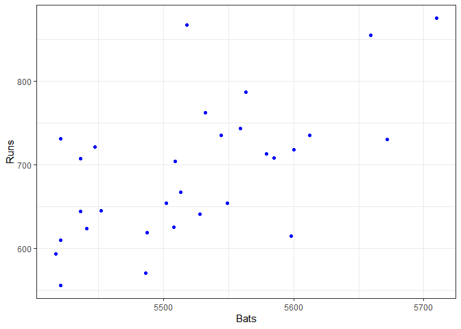<!-- -->

<div class="exercise">

If you knew a team’s `at_bats`, would you be comfortable using a linear
model to predict their number of runs? Answer: Yes

</div>

If the relationship looks linear, we can quantify the strength of the
relationship with the correlation coefficient.

``` r
mlb11 %>%
  summarise(cor(runs, at_bats))
```

    ## # A tibble: 1 x 1
    ##   `cor(runs, at_bats)`
    ##                  <dbl>
    ## 1                0.611

## Sum of squared residuals

<div class="boxedtext">

In this section you will use an interactive function to investigate what
we mean by “sum of squared residuals”. You will need to run this
function in your console, not in your markdown document. Running the
function also requires that the `mlb11` dataset is loaded in your
environment.

</div>

Think back to the way that we described the distribution of a single
variable. Recall that we discussed characteristics such as center,
spread, and shape. It’s also useful to be able to describe the
relationship of two numerical variables, such as `runs` and `at_bats`
above.

<div class="question">

Looking at your plot from the previous exercise, which of the following
best describe the relationship between these two variables?

-   The relationship is negative, linear, and moderately strong. One of
    the potential outliers is a team with approximately 5520 at bats.
-   The relationship is positive, linear, and moderately strong. One of
    the potential outliers is a team with approximately 5520 at bats.
-   The relationship is positive, linear, and very weak. There are no
    outliers.
-   The relationship is positive, linear, and very weak. One of the
    potential outliers is a team with approximately 5520 at bats.

Answer: The relationship is positive, linear, and moderately strong. One
of the potential outliers is a team with approximately 5520 at bats.

</div>

Just as we used the mean and standard deviation to summarize a single
variable, we can summarize the relationship between these two variables
by finding the line that best follows their association. Use the
following interactive function to select the line that you think does
the best job of going through the cloud of points.

``` r
plot_ss(x = at_bats, y = runs, data = mlb11)
```

After running this command, you’ll be prompted to click two points on
the plot to define a line. Once you’ve done that, the line you specified
will be shown in black and the residuals in blue. Note that there are 30
residuals, one for each of the 30 observations. Recall that the
residuals are the difference between the observed values and the values
predicted by the line:

*e*<sub>*i*</sub> = *y*<sub>*i*</sub> − *ŷ*<sub>*i*</sub>

The most common way to do linear regression is to select the line that
minimizes the sum of squared residuals. To visualize the squared
residuals, you can rerun the plot command and add the argument
`showSquares = TRUE`.

``` r
plot_ss(x = at_bats, y = runs, data = mlb11, showSquares = TRUE)
```

Note that the output from the `plot_ss` function provides you with the
slope and intercept of your line as well as the sum of squares.

<div class="exercise">

Using `plot_ss`, choose a line that does a good job of minimizing the
sum of squares. Run the function several times. Report your smallest sum
of squares.

</div>

## The linear model

It is rather cumbersome to try to get the correct least squares line,
i.e. the line that minimizes the sum of squared residuals, through trial
and error. Instead we can use the `lm` function in R to fit the linear
model (a.k.a. regression line).

``` r
m1 <- lm(runs ~ at_bats, data = mlb11)
```

The first argument in the function `lm` is a formula that takes the form
`y ~ x`. Here it can be read that we want to make a linear model of
`runs` as a function of `at_bats`. The second argument specifies that R
should look in the `mlb11` data frame to find the `runs` and `at_bats`
variables.

The output of `lm` is an object that contains all of the information we
need about the linear model that was just fit. We can access this
information using the summary function.

``` r
report(m1)
```

    ## We fitted a linear model (estimated using OLS) to predict runs with at_bats (formula: runs ~ at_bats). The model explains a statistically significant and substantial proportion of variance (R2 = 0.37, F(1, 28) = 16.65, p < .001, adj. R2 = 0.35). The model's intercept, corresponding to at_bats = 0, is at -2789.24 (95% CI [-4537.96, -1040.53], t(28) = -3.27, p = 0.003). Within this model:
    ## 
    ##   - The effect of at bats is statistically significant and positive (beta = 0.63, 95% CI [0.31, 0.95], t(28) = 4.08, p < .001; Std. beta = 0.61, 95% CI [0.30, 0.92])
    ## 
    ## Standardized parameters were obtained by fitting the model on a standardized version of the dataset. 95% Confidence Intervals (CIs) and p-values were computed using the Wald approximation.

Let’s consider this output piece by piece. First, the formula used to
describe the model is shown at the top. After the formula you find the
five-number summary of the residuals. The “Coefficients” table shown
next is key; its first column displays the linear model’s y-intercept
and the coefficient of `at_bats`. With this table, we can write down the
least squares regression line for the linear model:

*ŷ* =  − 2789.2429 + 0.6305 × *a**t*\_*b**a**t**s*

One last piece of information we will discuss from the summary output is
the Multiple R-squared, or more simply, *R*<sup>2</sup>. The
*R*<sup>2</sup> value represents the proportion of variability in the
response variable that is explained by the explanatory variable. For
this model, 37.3% of the variability in runs is explained by at-bats.

<div class="question">

Fit a new model that uses `homeruns` to predict `runs`. Using the
estimates from the R output, write the equation of the regression line.
What does the slope tell us in the context of the relationship between
success of a team and its home runs?

-   For each additional home run, the model predicts 1.83 more runs, on
    average.
-   Each additional home run increases runs by 1.83.
-   For each additional home run, the model predicts 1.83 fewer runs, on
    average.
-   For each additional home run, the model predicts 415.24 more runs,
    on average.  
-   For each additional home run, the model predicts 415.24 fewer runs,
    on average. Answer : For each additional home run, the model
    predicts 1.83 more runs, on average.

</div>

``` r
# type your code for Question 4 here, and Knit
nm<-lm(runs~homeruns,data = mlb11)
report(nm)
```

    ## We fitted a linear model (estimated using OLS) to predict runs with homeruns (formula: runs ~ homeruns). The model explains a statistically significant and substantial proportion of variance (R2 = 0.63, F(1, 28) = 46.98, p < .001, adj. R2 = 0.61). The model's intercept, corresponding to homeruns = 0, is at 415.24 (95% CI [329.87, 500.61], t(28) = 9.96, p < .001). Within this model:
    ## 
    ##   - The effect of homeruns is statistically significant and positive (beta = 1.83, 95% CI [1.29, 2.38], t(28) = 6.85, p < .001; Std. beta = 0.79, 95% CI [0.55, 1.03])
    ## 
    ## Standardized parameters were obtained by fitting the model on a standardized version of the dataset. 95% Confidence Intervals (CIs) and p-values were computed using the Wald approximation.

## Prediction and prediction errors

Let’s create a scatterplot with the least squares line for `m1` laid on
top.

``` r
ggplot(data = mlb11, aes(x = at_bats, y = runs)) +
  geom_point() +
  stat_smooth(method = "lm", se = FALSE)
```

    ## `geom_smooth()` using formula 'y ~ x'

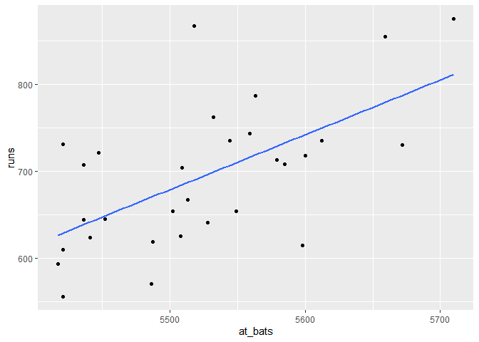<!-- -->

Here we are literally adding a layer on top of our plot. `stat_smooth`
creates the line by fitting a linear model. It can also show us the
standard error `se` associated with our line, but we’ll suppress that
for now.

This line can be used to predict *y* at any value of *x*. When
predictions are made for values of *x* that are beyond the range of the
observed data, it is referred to as *extrapolation* and is not usually
recommended. However, predictions made within the range of the data are
more reliable. They’re also used to compute the residuals.

<div class="exercise">

If a team manager saw the least squares regression line and not the
actual data, how many runs would he or she predict for a team with 5,579
at-bats? Is this an overestimate or an underestimate, and by how much?
Answer : 750

</div>

To find the observed number of runs for the team with 5,579 at bats you
can use the following:

``` r
mlb11 %>%
  filter(at_bats == 5579) %>%
  select(runs)
```

This code first filters for rows observation. `at_bats` is 5579, and
then shows the value of the \`runs variable for that observation.

<div class="question">

What is the residual for the prediction of runs for a team with 5,579
at-bats? Choose the closest answer.

-   -15.32
-   15.32
-   713
-   5579

</div>

``` r
# type your code for Question 5 here, and Knit

713-(-2789.24+0.6305*5579)->r
r
```

    ## [1] -15.3195

## Model diagnostics

To assess whether the linear model is reliable, we need to check for (1)
linearity, (2) nearly normal residuals, and (3) constant variability.

**Linearity**: You already checked if the relationship between runs and
at-bats is linear using a scatterplot. We should also verify this
condition with a plot of the residuals vs. fitted (predicted) values.

``` r
ggplot(data = m1, aes(x = .fitted, y = .resid)) +
  geom_point() +
  geom_hline(yintercept = 0, linetype = "dashed") +
  xlab("Fitted values") +
  ylab("Residuals")
```

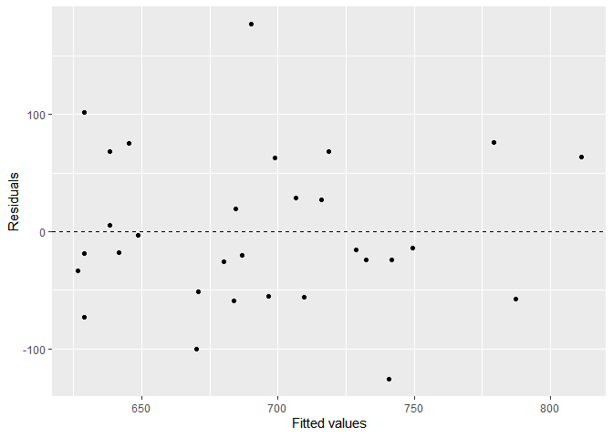<!-- -->

Notice here that our model object `m1` can also serve as a data set
because stored within it are the fitted values (*ŷ*) and the residuals.
Also note that we’re getting fancy with the code here. After creating
the scatterplot on the first layer (first line of code), we overlay a
horizontal dashed line at *y* = 0 (to help us check whether residuals
are distributed around 0), and we also adjust the axis labels to be more
informative.

<div class="question">

Which of the following statements about the residual plot is false?

-   The residuals appear to be randomly distributed around 0.  
-   The residuals show a curved pattern.  
-   The plot is indicative of a linear relationship between runs and
    at-bats.  
-   The team with a very high residual compared to the others appears to
    be an outlier. Anwer: The residuals show a curved pattern.

</div>

**Nearly normal residuals**: To check this condition, we can look at a
histogram

``` r
ggplot(data = m1, aes(x = .resid)) +
  geom_histogram(binwidth = 25) +
  xlab("Residuals")
```

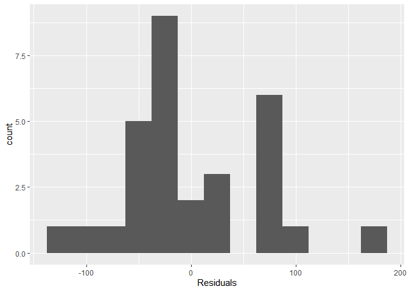<!-- -->

or a normal probability plot of the residuals.

``` r
ggplot(data = m1, aes(sample = .resid)) +
  stat_qq()
```

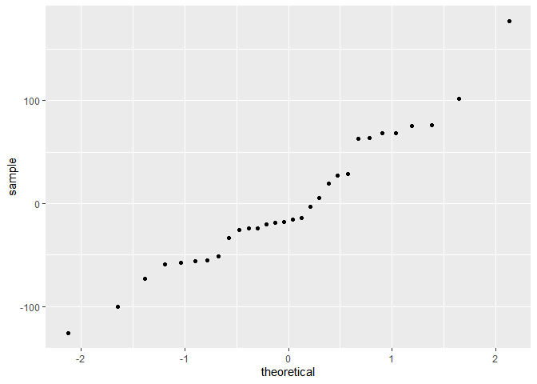<!-- -->

Note that the syntax for making a normal probability plot is a bit
different than what you’re used to seeing: we set `sample` equal to the
residuals instead of `x`, and we set a statistical method `qq`, which
stands for “quantile-quantile”, another name commonly used for normal
probability plots.

<div class="question">

Which of the following is true?

-   The residuals are extremely right skewed, hence the normal
    distribution of residuals condition is not met.
-   The residuals are extremely left skewed, hence the normal
    distribution of residuals condition is not met.  
-   The residuals are perfectly symmetric, hence the normal distribution
    of residuals condition is met.
-   The residuals are fairly symmetric, with only a slightly longer tail
    on the right, hence it would be appropriate to deem the the normal
    distribution of residuals condition met. Answer: The residuals are
    fairly symmetric, with only a slightly longer tail on the right,
    hence it would be appropriate to deem the the normal distribution of
    residuals condition met.

</div>

**Constant variability**:

<div class="question">

Based on the residuals plot from earlier, the constant variability
condition appears to be met.

-   True
-   False Answer: True

</div>

<div class="exercise">

Choose another one of the seven traditional variables from `mlb11`
besides `at_bats` that you think might be a good predictor of `runs`.
Produce a scatterplot of the two variables and fit a linear model. At a
glance, does there seem to be a linear relationship?

</div>

``` r
# type your code for the Exercise here, and Knit
ggplot(mlb11,aes(y=runs,x=hits))+geom_point()
```

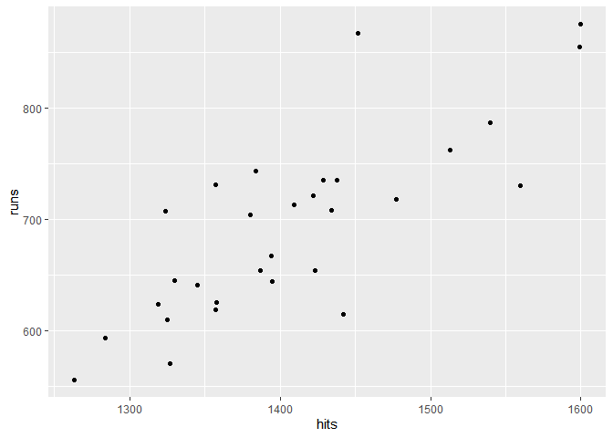<!-- -->

<div class="exercise">

How does this relationship compare to the relationship between `runs`
and `at_bats`? Use the R<sup>2</sup> values from the two model summaries
to compare. Does your variable seem to predict `runs` better than
`at_bats`? How can you tell? Answer: As runs move up, hits also goes up,
the relationship is linear

</div>

``` r
# type your code for the Exercise here, and Knit
mlb11 %>% 
  summarise(cor(runs,hits))
```

    ## # A tibble: 1 x 1
    ##   `cor(runs, hits)`
    ##               <dbl>
    ## 1             0.801

<div class="question">

Now that you can summarize the linear relationship between two
variables, investigate the relationships between `runs` and each of the
other five traditional variables. Which variable best predicts `runs`?
Support your conclusion using the graphical and numerical methods we’ve
discussed.

-   at bats
-   hits
-   wins
-   batting average Answer : batting average

</div>

``` r
# type your code for Question 9 here, and Knit
ggplot(mlb11,aes(y=runs,x=wins))+geom_point()
```

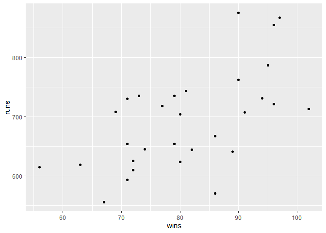<!-- -->

``` r
mlb11 %>% 
  summarise(cor(runs,wins))
```

    ## # A tibble: 1 x 1
    ##   `cor(runs, wins)`
    ##               <dbl>
    ## 1             0.601

``` r
ggplot(mlb11,aes(y=runs,x= mlb11$bat_avg ))+geom_point()
```

    ## Warning: Use of `mlb11$bat_avg` is discouraged. Use `bat_avg` instead.

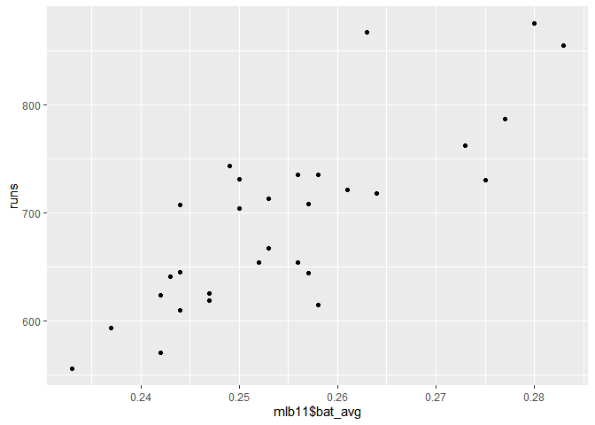<!-- -->

``` r
mlb11 %>% 
summarise(cor(runs,bat_avg))
```

    ## # A tibble: 1 x 1
    ##   `cor(runs, bat_avg)`
    ##                  <dbl>
    ## 1                0.810

<div class="question">

Now examine the three newer variables. These are the statistics used by
the author of *Moneyball* to predict a teams success. In general, are
they more or less effective at predicting runs that the old variables?
Explain using appropriate graphical and numerical evidence. Of all ten
variables we’ve analyzed, which seems to be the best predictor of
`runs`?

-   on-base plus slugging (`new_obs`)
-   slugging percentage (`new_slug`)  
-   on-base percentage (`new_onbase`)

</div>

``` r
# type your code for Question 10 here, and Knit
 ggplot(mlb11,aes(new_obs,runs))+geom_point()
```

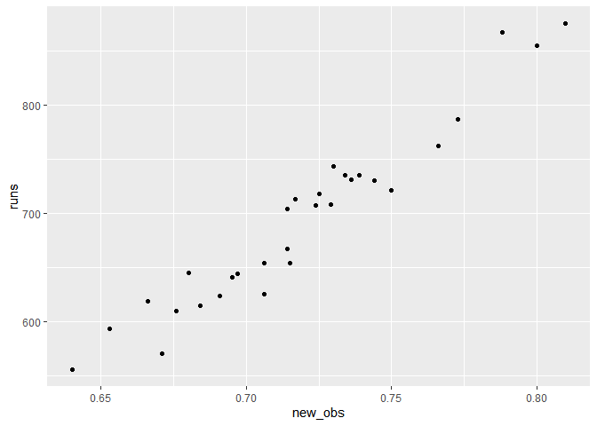<!-- -->

``` r
mlb11 %>% 
  summarise(cor(runs,new_obs))
```

    ## # A tibble: 1 x 1
    ##   `cor(runs, new_obs)`
    ##                  <dbl>
    ## 1                0.967

``` r
ggplot(mlb11,aes(new_slug,runs))+geom_point()
```

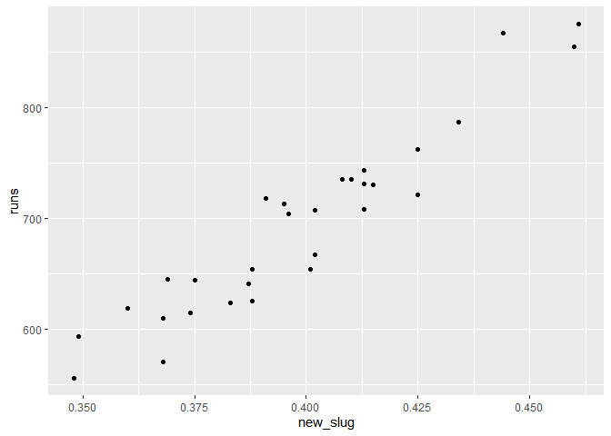<!-- -->

``` r
ggplot(mlb11,aes(new_onbase,runs))+geom_point()
```

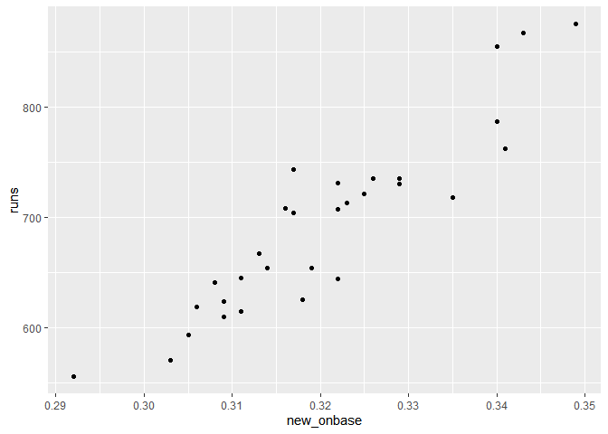<!-- -->

``` r
mlb11 %>% summarise(cor(runs,new_onbase))
```

    ## # A tibble: 1 x 1
    ##   `cor(runs, new_onbase)`
    ##                     <dbl>
    ## 1                   0.921

``` r
# mlb11 %>% 
#   summarise(cor(runs,new_slug))
```

<div class="exercise">

Check the model diagnostics for the regression model with the variable
you decided was the best predictor for runs.

</div>

``` r
# type your code for the Exercise here, and Knit
winner<- lm(runs~new_obs,data = mlb11)
report(winner)
```

    ## We fitted a linear model (estimated using OLS) to predict runs with new_obs (formula: runs ~ new_obs). The model explains a statistically significant and substantial proportion of variance (R2 = 0.93, F(1, 28) = 402.29, p < .001, adj. R2 = 0.93). The model's intercept, corresponding to new_obs = 0, is at -686.61 (95% CI [-827.80, -545.43], t(28) = -9.96, p < .001). Within this model:
    ## 
    ##   - The effect of new obs is statistically significant and positive (beta = 1919.36, 95% CI [1723.34, 2115.39], t(28) = 20.06, p < .001; Std. beta = 0.97, 95% CI [0.87, 1.07])
    ## 
    ## Standardized parameters were obtained by fitting the model on a standardized version of the dataset. 95% Confidence Intervals (CIs) and p-values were computed using the Wald approximation.

``` r
##checking for normal residual
ggplot(winner,aes(.resid))+geom_histogram(binwidth=25)
```

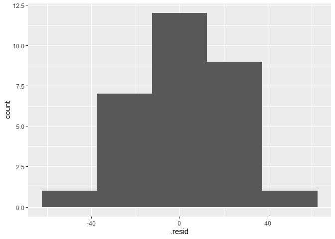<!-- -->

<div id="license">

This is a product of OpenIntro that is released under a [Creative
Commons Attribution-ShareAlike 3.0
Unported](http://creativecommons.org/licenses/by-sa/3.0). This lab was
adapted for OpenIntro by Andrew Bray and Mine Çetinkaya-Rundel from a
lab written by the faculty and TAs of UCLA Statistics.

</div>
